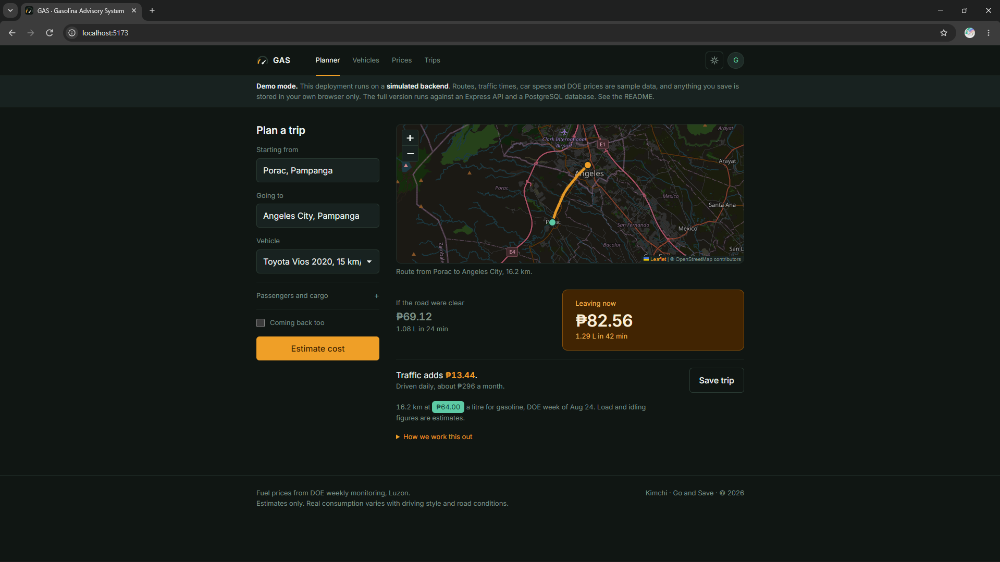
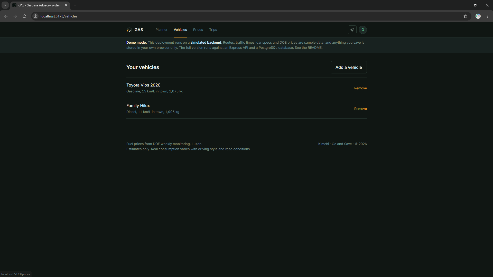
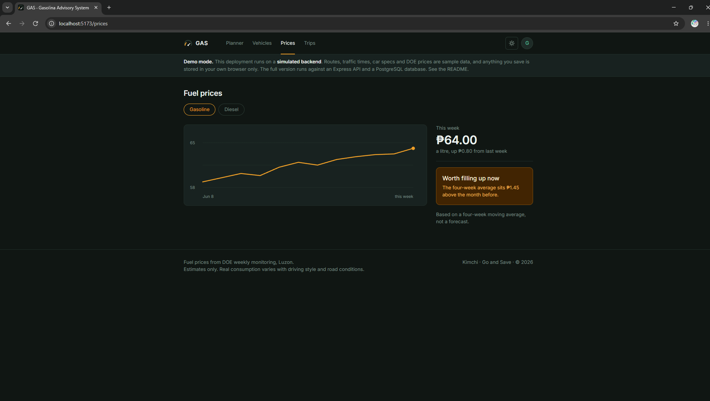
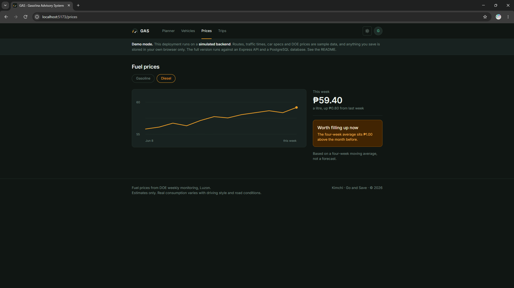
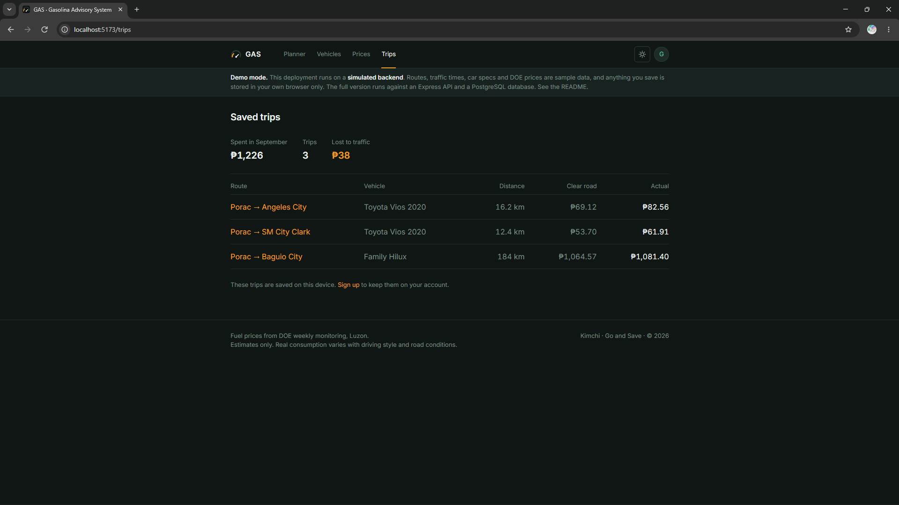
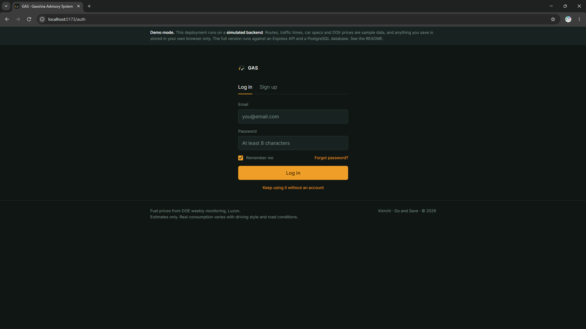
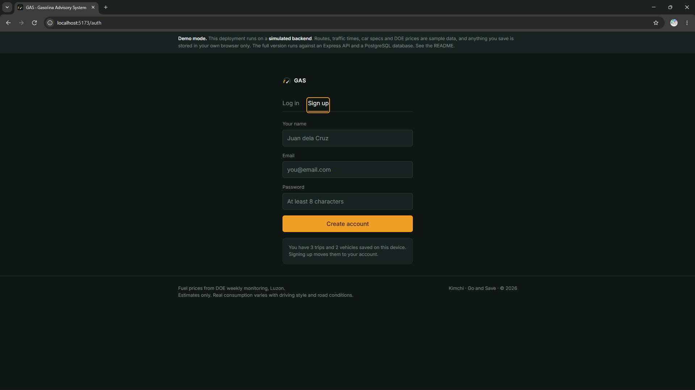

# GAS — Gasolina Advisory System

GAS tells a Philippine driver what a trip will cost in fuel before they leave:
once for clear roads, and once for the traffic happening right now.

**Live site:** https://kimch-i.github.io/Go-And-Save/
**API:** not deployed yet
**Demo video:** (link)

> **This deployment is running in demo mode.** The interface is real; the backend
> is simulated in your browser so the site works without a server. See
> [Demo mode](#demo-mode) below. Delete this quote once the API is live.

## What it does

- Enter where you are starting from and where you are going, pick your car, and
  say how many people and how much cargo are riding
- See two peso figures side by side: **if the road were clear**, and **leaving now**
  in current traffic, plus what traffic adds per trip and per month
- Save trips and see what a repeated commute costs, and how much of it is lost to traffic
- Pick your car from a catalog of Philippine-market vehicles instead of guessing your km/L
- Check this week's DOE fuel price and whether it is worth filling up now

Traffic does not change the distance, it changes the time. The extra cost is the
fuel burned idling in the delay, which is why the two figures differ.

## Built with

React and Vite on the front end, with React Router, CSS Modules and Leaflet with
OpenStreetMap tiles. Express and PostgreSQL on the back end, with route times from
the TomTom Routing API and place search from Nominatim. The client is on GitHub
Pages; the API and database hosts are not chosen yet.

## Demo mode

This repository can run two ways, chosen by one environment variable at **build**
time.

**Demo mode is the default.** Only the exact string `false` turns it off, so a
forgotten or mistyped variable leaves you on the simulated backend with a visible
notice rather than on a silently broken build.

| `VITE_USE_MOCK_API` | What happens |
| --- | --- |
| unset, or `true` | The client answers its own requests from `client/src/api/mockApi.js`. Routes, traffic times, car specs and DOE prices come from `seed.json`; saved vehicles and trips stay in your browser. |
| `false` | The client calls the Express API at `VITE_API_BASE_URL`, which reads and writes real PostgreSQL. |

Demo mode is a starting point and a fallback, not the finished project. The finals
submission is all three pieces deployed and talking to each other.

## Running it yourself

**The client only, in demo mode.** No database needed.

    cd client
    npm install
    cp .env.example .env        # VITE_USE_MOCK_API stays true
    npm run dev                 # http://localhost:5173
    npm test                    # the estimate maths, price trend and api layer

**The whole stack.** The `server/` folder is still the course template's example
API. It becomes the GAS API next; the routes it needs are listed at the top of
`client/src/api/httpApi.js`.

## Environment variables

None of these are committed. `.env.example` in each folder lists them with
placeholder values.

| Name | Where | What it is |
| --- | --- | --- |
| `DATABASE_URL` | server | PostgreSQL connection string. Contains a password |
| `CORS_ORIGINS` | server | comma-separated origins allowed to call the API |
| `TOMTOM_API_KEY` | server | for route and traffic times. Never in a `VITE_` variable |
| `NODE_ENV` | server | `production` on the host |
| `PORT` | server | set by the host |
| `VITE_USE_MOCK_API` | client, at build time | only `false` turns demo mode off |
| `VITE_API_BASE_URL` | client, at build time | the API's public URL, no trailing slash |

Every `VITE_` value is compiled into the built JavaScript and is **public**.

## Deploying

**Client, to GitHub Pages.** `.github/workflows/deploy-pages.yml` builds and
publishes on every push to `main` that touches `client/`. One-time setup:

1. The repository must be **public**.
2. **Settings > Pages > Build and deployment > Source: GitHub Actions.**
3. Once the API is live, set `VITE_USE_MOCK_API` = `false` and `VITE_API_BASE_URL`
   under **Settings > Secrets and variables > Actions > Variables**, then re-run
   the workflow.

The workflow sets the base path to `/Go-And-Save/`, and the build copies
`index.html` to `404.html`, so refreshing on `/trips` or `/vehicles` still works.

## Project structure

    client/
      public/theme.js     sets the theme before first paint, so it never flashes
      src/
        App.jsx           routes, and the state more than one screen needs
        api/              ONE interface, two implementations, chosen by a variable
          index.js          the only file screens import data from
          mockApi.js        simulated backend (seed.json + localStorage)
          httpApi.js        the Express API
        lib/              pure functions, no React: estimate.js, priceTrend.js, ...
        services/         what stays in the browser: theme, preferences, session
        styles/           tokens.css (two token layers) and base.css
        components/
          atoms/          Button, TextInput, Select, Checkbox, Stepper, Tag, Spinner, Logo
          molecules/      LocationSearch, CostCard, LoadPanel, VehicleRow, TripRow, ...
          organisms/      Header, Footer, TripForm, RouteMap, EstimateResult, TripTable, ...
        pages/            one folder per route, plus AppLayout
    server/               Express API (still the template's example)
    docs/                 planning documents and weekly reports

Each component is a folder with a `.jsx` file and a `.module.css` file. A level
never imports the level above it.

| Route | Screen |
| --- | --- |
| `/` | Trip Planner — works fully without an account |
| `/vehicles`, `/vehicles/add` | Your vehicles, and the catalog search |
| `/prices` | DOE prices, 12-week chart, fill-up-now reading |
| `/trips` | Saved trips, monthly totals, lost to traffic |
| `/auth` | Log in / Sign up, one route with two tabs |
| `/profile` | Account, theme, default vehicle, home location, export |

## API (planned, not built yet)

The client already calls these through `client/src/api/httpApi.js`. The Express
server in `server/` will provide them; right now it is still the course
template's example API.

| Method | Path | What it does |
| --- | --- | --- |
| GET | `/api/places?q=` | Search places (Nominatim) |
| GET | `/api/route` | Distance plus traffic and no-traffic travel time (TomTom) |
| GET | `/api/prices` | Weekly DOE fuel prices |
| GET | `/api/cars?q=` | Search the Philippine car catalog |
| GET, POST | `/api/vehicles` | List or add your vehicles |
| DELETE | `/api/vehicles/:id` | Remove a vehicle |
| GET, POST | `/api/trips` | List or save trips |
| DELETE | `/api/account` | Delete your account data |

## Architecture

The React client is the only thing the user loads. Every screen gets its data
through `client/src/api/index.js`, which today answers from the browser and later
calls the Express API. The API will call TomTom and Nominatim on the server, so no
key reaches the browser, and read and write PostgreSQL for the car catalog, DOE
prices, vehicles and trips. The two-number estimate itself is a pure function in
`client/src/lib/estimate.js` and runs in the browser, so changing passengers or
cargo updates the figures without a request.

## Known issues

- The server is still the template's example. There is no PostgreSQL, no TomTom
  and no Nominatim wired up yet, so the app only runs in demo mode.
- The car catalog in `seed.json` has a handful of sample cars, not the real 50 to
  80 Philippine vehicles the project targets.
- The TomTom free tier changed pricing on 1 July 2026 and has not been re-checked
  against this project. If traffic data is unavailable once it is wired up, the
  app should fall back to the ideal-only estimate.
- There is no real authentication yet. Session is simulated for demo mode.

## What I would do next

- Replace the template's example server with the GAS API: the routes listed in
  `httpApi.js`, the schema, and seeded car catalog and DOE price tables
- Confirm the TomTom free tier still returns both travel time and no-traffic time
  after its July 2026 pricing change, before wiring the planner to it
- Real accounts with email, password and JWT, moving a guest's saved trips to the
  account on first sign-up

## Developer

Kimchi © 2026

## AI use

Claude (Anthropic) was used as an AI coding assistant throughout the project for
coding support, debugging, troubleshooting, and implementation assistance. The
full details are available in [AI-USAGE.md](AI-USAGE.md).

## Licence

MIT, see [LICENSE](LICENSE).
