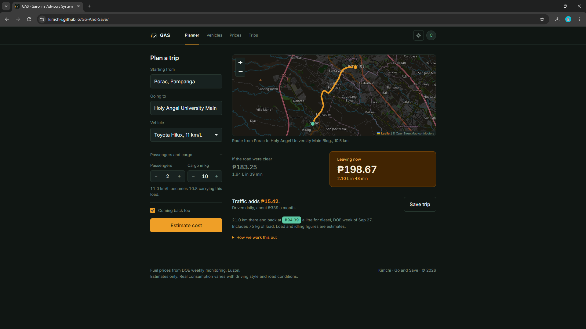
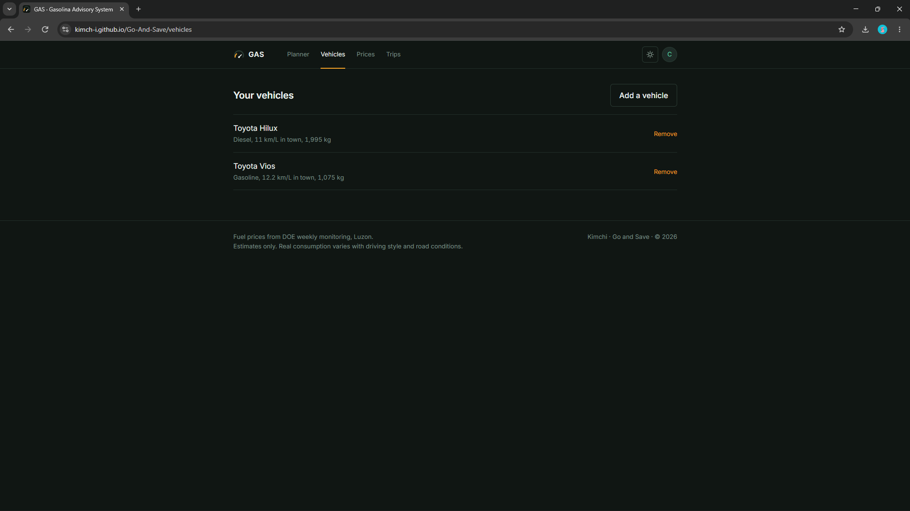
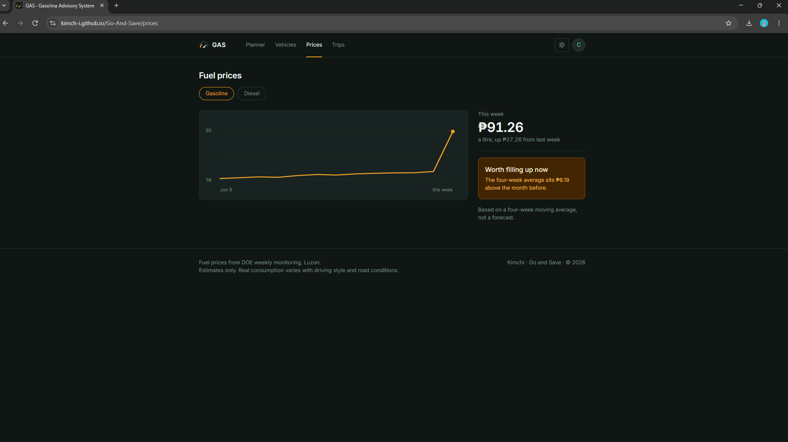
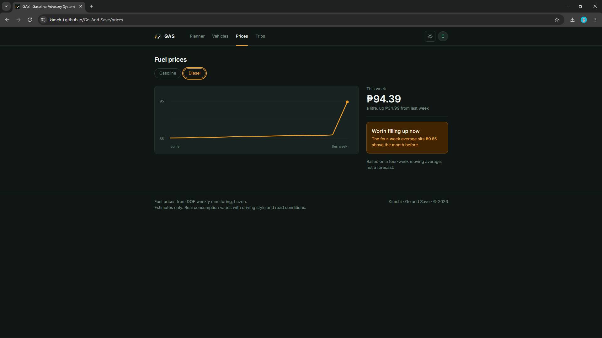
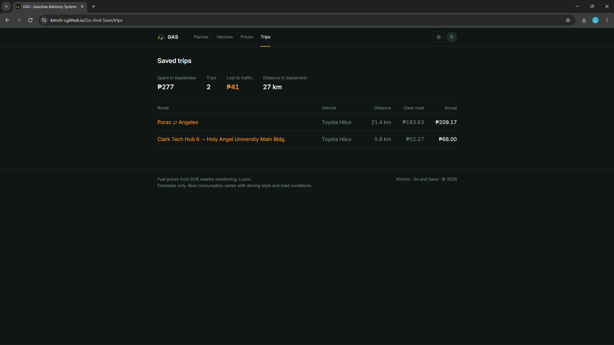
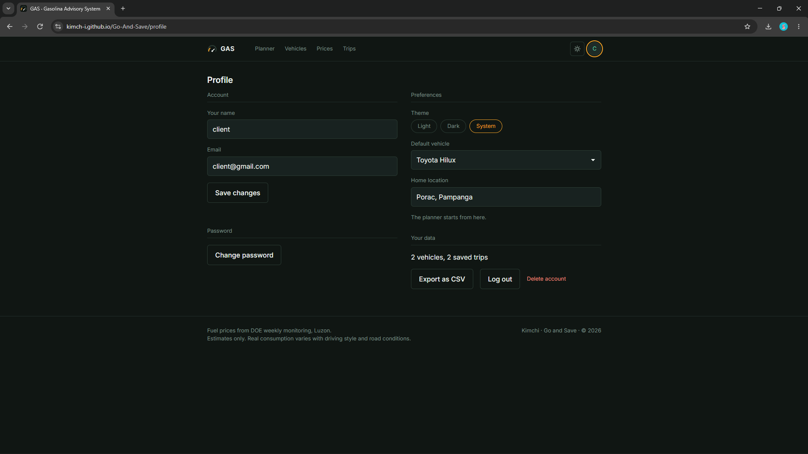
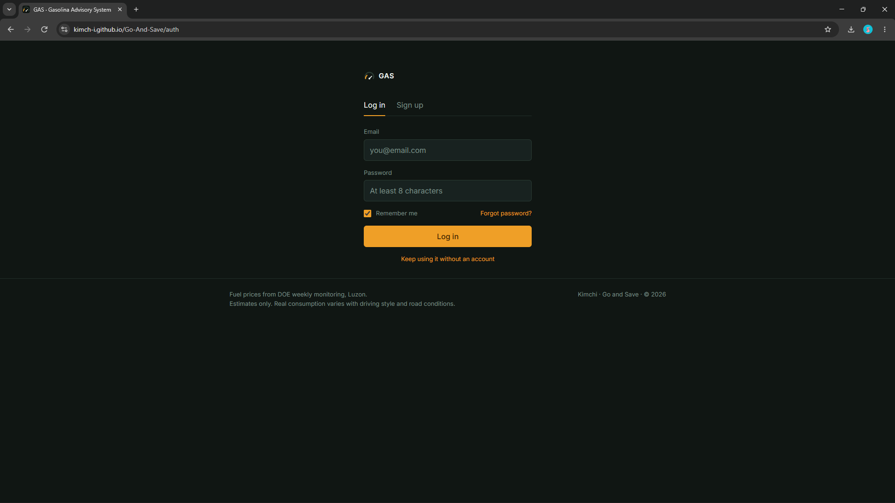
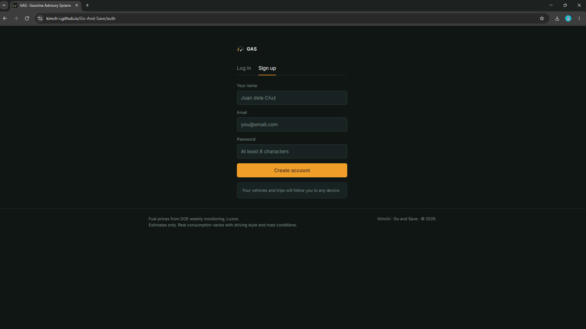

# GAS — Go And Save

GAS tells a Philippine driver what a trip will cost in fuel before they leave:
once for clear roads, and once for the traffic happening right now.

**Live site:** https://kimch-i.github.io/Go-And-Save/
**API:** https://gas-server-scf1.onrender.com/healthz
**Demo video:** https://drive.google.com/file/d/1FP3a8QMY90J2CAwJfEkG-PJG1AHJW1UI/view?usp=sharing

## What it does

- Enter where you are starting from and where you are going, pick your car, and
  say how many people and how much cargo are riding
- See two peso figures side by side: **if the road were clear**, and **leaving now**
  in current traffic, plus what traffic adds per trip and per month
- Save trips and see what a repeated commute costs, how much of it is lost to
  traffic, and two charts of fuel spend and distance by day
- Pick your car from a catalog of 66 Philippine-market vehicles instead of
  guessing your km/L
- Check this week's fuel price and whether it is worth filling up now, on a
  price history that a weekly automated check keeps current (see
  [Fuel price updates](#fuel-price-updates) below)

Traffic does not change the distance, it changes the time. The extra cost is the
fuel burned idling in the delay, which is why the two figures differ.

## Built with

React and Vite on the front end, with React Router, CSS Modules and Leaflet with
OpenStreetMap tiles. Express and PostgreSQL on the back end, with route times from
the TomTom Routing API and place search from Nominatim. The client is on GitHub
Pages, the database is hosted on Neon, and the API is on Render.

## Demo mode

This repository can run two ways, chosen by one environment variable at **build**
time.

**Demo mode is the default.** Only the exact string `false` turns it off, so a
forgotten or mistyped variable leaves you on the simulated backend with a visible
notice rather than on a silently broken build. The deployed site above is built
with it off, so it talks to the real API.

| `VITE_USE_MOCK_API` | What happens |
| --- | --- |
| unset, or `true` | The client answers its own requests from `client/src/api/mockApi.js`. Routes, traffic times, car specs and prices come from `seed.json`; saved vehicles and trips stay in your browser. |
| `false` | The client calls the Express API at `VITE_API_BASE_URL`, which reads and writes real PostgreSQL. |

Demo mode is still useful for running the front end with nothing to install, but
the finals submission is all three pieces deployed and talking to each other,
which is now the case for the live site.

## Running it yourself

**The client only, in demo mode.** No database needed.

    cd client
    npm install
    cp .env.example .env        # VITE_USE_MOCK_API stays true
    npm run dev                 # http://localhost:5173
    npm test                    # the estimate maths, price trend and api layer

**The whole stack, locally.**

    cd server
    npm install
    cp .env.example .env        # fill in DATABASE_URL, TOMTOM_API_KEY, JWT_SECRET
    npm run db:reset            # creates tables, loads the 66-car catalog and price history
    npm run dev                 # http://localhost:3000

    cd client
    # set VITE_USE_MOCK_API=false and VITE_API_BASE_URL=http://localhost:3000 in .env
    npm run dev                 # http://localhost:5173

## Environment variables

None of these are committed. `.env.example` in each folder lists them with
placeholder values.

| Name | Where | What it is |
| --- | --- | --- |
| `DATABASE_URL` | server | PostgreSQL connection string (a Neon string in production). Contains a password |
| `CORS_ORIGINS` | server | comma-separated origins allowed to call the API |
| `TOMTOM_API_KEY` | server | for route and traffic times. Never in a `VITE_` variable |
| `JWT_SECRET` | server | signs login tokens |
| `NODE_ENV` | server | `production` on the host, `development` locally |
| `PORT` | server | set by the host, never set this yourself |
| `VITE_USE_MOCK_API` | client, at build time | only `false` turns demo mode off |
| `VITE_API_BASE_URL` | client, at build time | the API's public URL, no trailing slash |

Every `VITE_` value is compiled into the built JavaScript and is **public**.

## Deploying

**Client, to GitHub Pages.** `.github/workflows/deploy-pages.yml` builds and
publishes on every push to `main` that touches `client/`. One-time setup:

1. The repository must be **public**.
2. **Settings > Pages > Build and deployment > Source: GitHub Actions.**
3. **Settings > Secrets and variables > Actions > Variables**, set
   `VITE_USE_MOCK_API` = `false` and `VITE_API_BASE_URL` to the API's URL.

The workflow sets the base path to `/Go-And-Save/`, and the build copies
`index.html` to `404.html`, so refreshing on `/trips` or `/vehicles` still works.

**Database, on Neon.** Free tier, no card required. Chosen over Render's own
free Postgres, which deletes itself after 30 days, a bad fit for a project
that runs the whole term. Create a project, copy the connection string, then
from `server/` run `npm run db:schema` and `npm run db:seed` against it once.

**API, on Render.** New Web Service, connect the repo, root directory
`server`, build command `npm install`, start command `npm start`, instance
type Free. Set `DATABASE_URL` (the Neon string), `CORS_ORIGINS`, `NODE_ENV`,
`TOMTOM_API_KEY` and `JWT_SECRET` under Environment. Do not set `PORT`, the
host sets it. The free instance sleeps after 15 minutes idle, so the first
request after a while takes 30 to 60 seconds to wake it up.

## Fuel price updates

Prices are not scraped live into the app. A scheduled GitHub Actions workflow
(`.github/workflows/update-fuel-prices.yml`) checks a public price page once a
week, and if it finds a plausible new number, opens a pull request with it
rather than writing it into the database directly, I still have to look at
the source and merge it myself. If the page cannot be parsed, the workflow
fails loudly and nothing is written, on purpose, a bad number nobody checked
is worse than a stale one.

Merging that pull request only changes `seed.sql` and `seed.json` in the
repo. It does not update the live database, `npm run db:seed` still has to be
run against it by hand afterwards.

## Project structure

    client/
      public/theme.js     sets the theme before first paint, so it never flashes
      src/
        App.jsx           routes, and the state more than one screen needs
        api/              ONE interface, two implementations, chosen by a variable
          index.js          the only file screens import data from
          mockApi.js        simulated backend (seed.json + localStorage)
          httpApi.js        the Express API
        lib/              pure functions, no React: estimate.js, priceTrend.js, ...
        services/         what stays in the browser: theme, preferences, session
        styles/           tokens.css (two token layers) and base.css
        components/
          atoms/          Button, TextInput, Select, Checkbox, Stepper, Tag, Spinner, Logo
          molecules/      LocationSearch, CostCard, LoadPanel, VehicleRow, TripRow, ...
          organisms/      Header, Footer, TripForm, RouteMap, EstimateResult, TripTable,
                           TripBarChart, PriceChart, ...
        pages/            one folder per route, plus AppLayout
    server/
      server.js          routes, helmet, rate limiting, error handling
      auth.js            password hashing, JWT sign and verify
      validate.js        server-side request validation
      tomtom.js           route and traffic times
      nominatim.js        place search
      db/                 pool, schema.sql, seed.sql, one repo file per table
    scripts/
      update-fuel-prices.mjs   the weekly price check
    docs/                planning documents and weekly reports

Each component is a folder with a `.jsx` file and a `.module.css` file. A level
never imports the level above it.

| Route | Screen |
| --- | --- |
| `/` | Trip Planner — works fully without an account |
| `/vehicles`, `/vehicles/add` | Your vehicles, and the catalog search |
| `/prices` | Fuel prices, weekly chart, fill-up-now reading |
| `/trips` | Saved trips, monthly totals, lost to traffic, spend and distance charts |
| `/auth` | Log in / Sign up, one route with two tabs |
| `/profile` | Account, theme, default vehicle, home location, export |

## API

Express server in `server/`, deployed to Render.

| Method | Path | What it does |
| --- | --- | --- |
| GET | `/healthz` | Is the process alive |
| GET | `/readyz` | Is the database reachable |
| GET | `/api/places?q=` | Search places (Nominatim) |
| GET | `/api/route` | Distance plus traffic and no-traffic travel time (TomTom) |
| GET | `/api/prices` | Weekly fuel prices |
| GET | `/api/cars?q=` | Search the Philippine car catalog |
| GET, POST | `/api/vehicles` | List or add your vehicles |
| DELETE | `/api/vehicles/:id` | Remove a vehicle |
| GET, POST | `/api/trips` | List or save trips |
| POST | `/api/auth/signup`, `/api/auth/login` | Create an account or log in |
| PUT, DELETE | `/api/account` | Update or delete your account |

`/api/auth/*`, `/api/places` and `/api/route` are rate limited, since the
first accepts a password and the other two spend a real, metered call against
Nominatim or TomTom on every request.

## Architecture

The React client is the only thing the user loads. Every screen gets its data
through `client/src/api/index.js`, which either answers from the browser
(demo mode) or calls the deployed Express API. The API calls TomTom and
Nominatim on the server, so no key reaches the browser, and reads and writes a
hosted PostgreSQL database on Neon for the car catalog, fuel prices, vehicles
and trips. The two-number estimate itself is a pure function in
`client/src/lib/estimate.js` and runs in the browser, so changing passengers
or cargo updates the figures without a request.

## Known issues

- Only one row of the 66-car catalog (the Vios) is backed by a cited source.
  The rest are my own estimates, from general knowledge of each model's
  class, not from a spec sheet. Labeled as estimates in `seed.sql`.
- Render's free web service sleeps after 15 minutes idle, so the first
  request after a while takes 30 to 60 seconds to wake it up. Not a bug, a
  free-tier tradeoff.
- The app has six routes, `/profile` included. The proposal caps it at five.
  This needs a decision, and the proposal, wireframes and design system
  should then agree with each other.
- Security checklist (`docs/06-security-and-privacy.md`) has not been walked
  through box by box, even though several items (parameterised queries,
  scoped CORS, helmet, rate limiting, a clean `npm audit`) are now true.

## What I would do next

- Finish `AI-USAGE.md`, now that `server/` has substantial work behind it
- Walk through the security and privacy checklist properly
- Decide the `/profile` route question and bring the proposal, wireframes and
  design system back into agreement
- Keep weekly reports and the reflection journal up day by day instead of
  writing them after the fact
- Record the demo video

## Developer

Kimchi © 2026

## AI use

I used Claude (Anthropic) as an AI coding assistant throughout the project, for
most features and most debugging — the frontend structure, the TomTom and
Nominatim integrations, the database schema, and fixing real production bugs
along the way. I reviewed and tested everything it gave me and adjusted it to
fit my system. The full session-by-session log is in
[AI-USAGE.md](AI-USAGE.md).

## Licence

MIT, see [LICENSE](LICENSE).
