# Design system

## Approach

Plain CSS with two token layers. Components never reference a hex value. They
reference a role. A theme is one block that re-points every role at different raw
values.

| Layer | What lives there |
|-------|------------------|
| 1. Raw palette | `--amber-500`, `--ink-700`, `--paper-050` |
| 2. Roles | `--brand`, `--surface`, `--text`, `--line` |

```css
:root {
  --amber-500: #EF9F27;
  --amber-700: #96590A;
  --ink-800: #101613;
  --paper-050: #FBFAF7;
}

[data-theme="dark"] {
  --bg: var(--ink-800);
  --brand: var(--amber-500);
}

[data-theme="light"] {
  --bg: var(--paper-050);
  --brand: var(--amber-700);
}
```

**Why roles.** The accent amber `#EF9F27` scores 2.08 to 1 on the light
background. That is unreadable against the 4.5 minimum. It works on dark and fails
on light. So `--brand` points to `#96590A` in the light theme. Same job, different
value. A token named for its value cannot survive a theme change. A token named
for its job can.

## Colour

Dark is the default theme. Light is the alternative. Switching theme changes one
attribute on `<html>` and no layout moves.

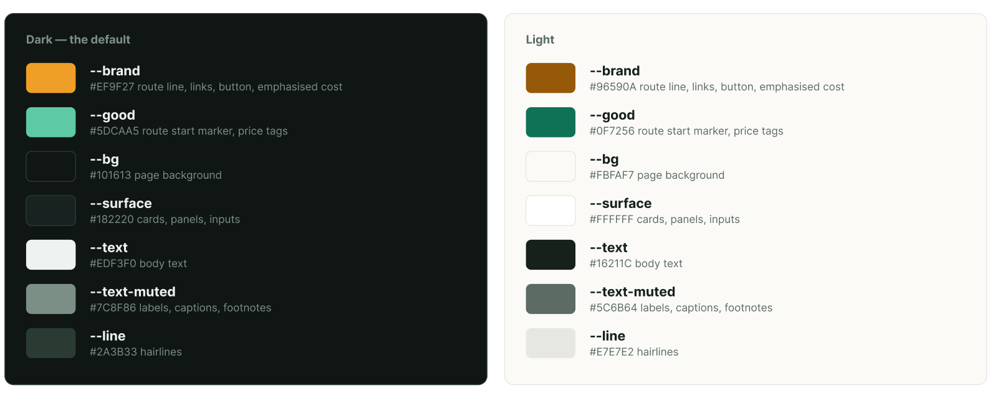

| Role | Used for | Dark | Light |
|------|----------|------|-------|
| `--brand` | route line, links, primary button, emphasised cost | `#EF9F27` | `#96590A` |
| `--good` | route start marker, price tags | `#5DCAA5` | `#0F7256` |
| `--bg` | page background | `#101613` | `#FBFAF7` |
| `--surface` | cards, panels, inputs | `#182220` | `#FFFFFF` |
| `--text` | body text | `#EDF3F0` | `#16211C` |
| `--text-muted` | labels, captions, footnotes | `#7C8F86` | `#5C6B64` |
| `--line` | hairlines | `#2A3833` | `#E7E7E2` |

`--brand-fill` is `#EF9F27` with `#3D2200` text in both themes. It is a
self-contained block that does not depend on the page behind it.

There is one accent. Brand carries the route line, links, the primary button and
the emphasised cost. Green is limited to the route start marker and price tags,
so the two never compete and the peso figure stays the focal point.

### Contrast

WCAG AA needs 4.5 to 1 for normal text. Every pair is checked in both themes.

| Pair | Dark | Light |
|------|------|-------|
| `--text` on `--bg` | 16.29 : 1 | 15.86 : 1 |
| `--text` on `--surface` | 14.49 : 1 | 16.55 : 1 |
| `--text-muted` on `--bg` | 5.34 : 1 | 5.37 : 1 |
| `--text-muted` on `--surface` | 4.75 : 1 | 5.61 : 1 |
| `--brand` on `--bg` | 8.42 : 1 | 5.39 : 1 |
| `--brand` on `--surface` | 7.49 : 1 | 5.62 : 1 |
| `--good` on `--bg` | 9.12 : 1 | 5.64 : 1 |
| `--good` on `--surface` | 8.11 : 1 | 5.89 : 1 |
| `#3D2200` on `--brand-fill` | 6.76 : 1 | 6.76 : 1 |

All pass. Muted text on the dark surface (4.75) is the tightest pair. It clears
4.5 with nothing to spare, so if the card colour is ever lightened, that value
must be rechecked.

## Type

Font family: **Inter** (weights 400, 500 and 600), loaded from Google Fonts. The fallback stack is the system UI fonts (`-apple-system`, Segoe UI, Roboto, sans-serif).

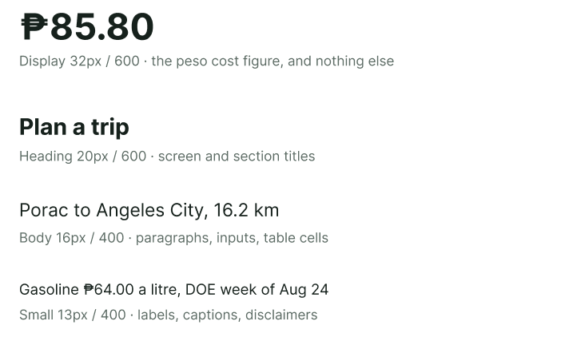

| Name | Size and weight | Used for |
|------|-----------------|----------|
| Display | 32px / 600 | the peso cost figure, and nothing else |
| Heading | 20px / 600 | screen and section titles |
| Body | 16px / 400 | paragraphs, inputs, table cells |
| Small | 13px / 400 | labels, captions, disclaimers |

Four sizes instead of three. The app exists to show one number, and at heading
size that number does not stand out enough. So Display is reserved for cost
figures and never used elsewhere. Body line height is 1.5 and headings are 1.2.
All figures use tabular numerals so they line up.

## Spacing

One scale. Everything is a multiple of 8. No arbitrary values.

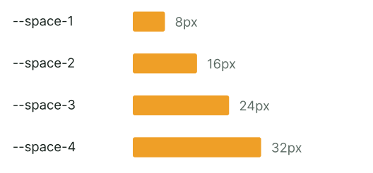

| Token | Value |
|-------|-------|
| `--space-1` | 8px |
| `--space-2` | 16px |
| `--space-3` | 24px |
| `--space-4` | 32px |

Screen edge padding is 16px on phone and 32px on desktop. Radius is 6px for inputs
and tags, and 10px for cards. Two values, not five.

## Components

Each reusable piece is built once and rendered with different props.

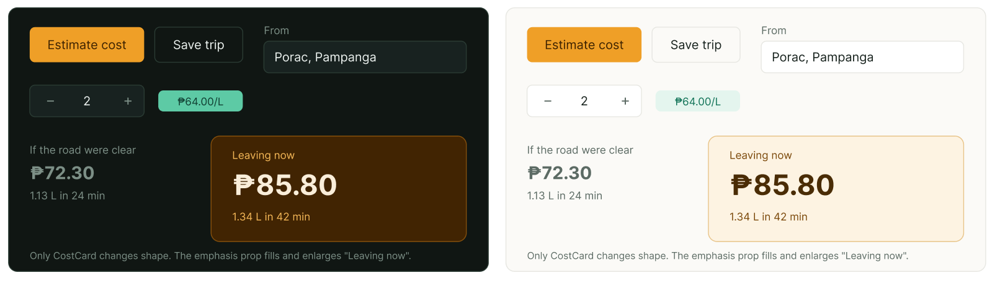

Only `CostCard` renders differently between the two uses on the planner. The
`emphasis` prop makes "Leaving now" larger and filled while "If the road were
clear" stays flat. Same component, one prop.

| Component | Level | Appears on | Props |
|-----------|-------|------------|-------|
| Button | atom | everywhere | `variant` ("primary" or "ghost"), `onClick`, `disabled`, `children` |
| TextInput | atom | Planner, Add Vehicle, Auth | `label`, `id`, `value`, `onChange`, `placeholder`, `type` |
| Stepper | atom | Planner (twice) | `label`, `value`, `min`, `max`, `onChange` |
| Tag | atom | Planner, Prices | `variant` ("neutral", "accent" or "warning"), `children` |
| Spinner | atom | Planner, Prices, Trips | `size` |
| Card | molecule | Vehicles, Trips, Prices, Planner | `children`, `filled` |
| CostCard | molecule | Planner (twice) | `label`, `amount`, `meta`, `emphasis` |
| LocationSearch | molecule | Planner (twice) | `label`, `value`, `onSelect` |
| EmptyState | molecule | Vehicles, Trips, Planner | `message`, `actionLabel`, `onAction`, `variant` ("empty" or "error") |
| Header | organism | every screen except `/auth` | `user`, `theme`, `onThemeToggle` |
| Footer | organism | every screen | none |

A level never imports the level above it. `CostCard` imports `Tag`, never
`EstimateResult`.

### Component states

The focus ring is 2px `--brand` on every interactive element, and because `--brand` is a role it stays visible in both
themes (8.42 dark, 5.39 light).

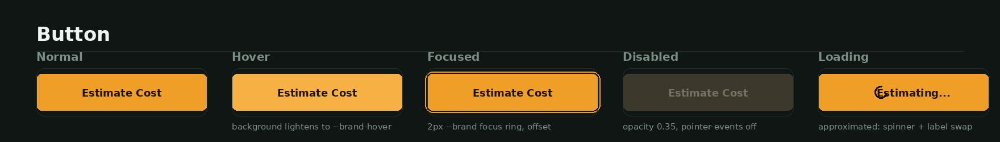

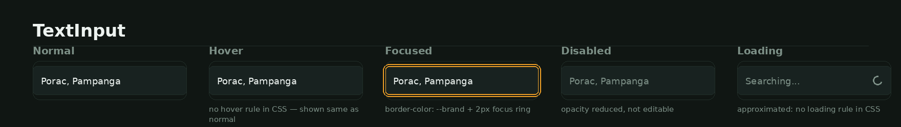

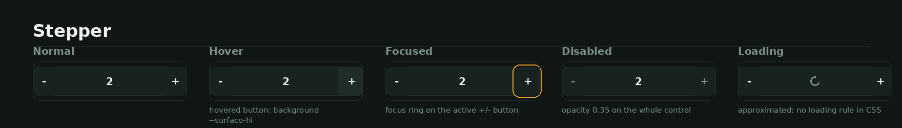

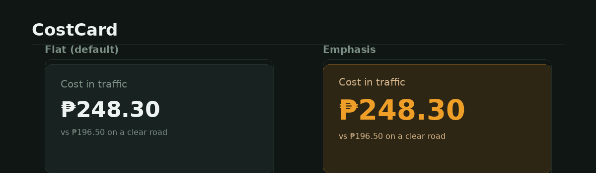

### Screen states

Loading, empty, error and data are four different screens.

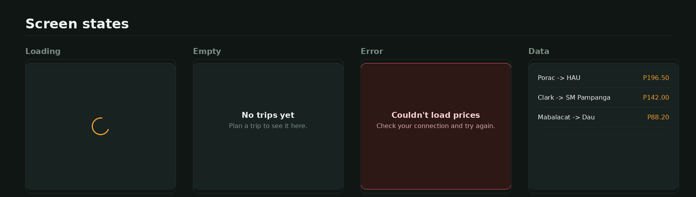

## Responsive plan

One breakpoint, at 768px. Each component module has a single
`@media (min-width: 768px)` block. Theme switching is not a breakpoint.

### Mobile, below 768px (designed at 375px)

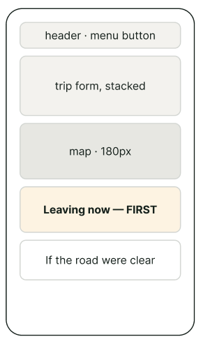

- The "Leaving now" card moves above the other one, because the first card is the
  one that gets read.
- Saved Trips is rebuilt as cards, one per trip. Tables do not shrink.
- On Prices the chart drops to the bottom.
- The header collapses to a menu button.
- No horizontal scrolling at 375px. The two things most likely to break it are the
  Saved Trips table, solved by the cards, and the map, which needs an explicit 100%
  width or Leaflet overflows its parent.

### Desktop, 768px and up

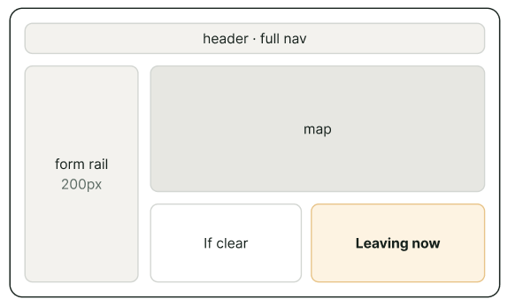

- The Trip Planner is two columns, a 200px form rail plus a flexible map and
  results column.
- "If the road were clear" and "Leaving now" sit side by side instead of stacked.
- The Saved Trips table shows all five columns.
- On Prices the chart sits beside the summary rail.
- The header shows full nav links.

## In code

- Raw palette and role tokens live in `client/src/styles/tokens.css`, with one
  `[data-theme="dark"]` block and one `[data-theme="light"]` block.
- Each reusable component is one folder under `client/src/components/atoms/`,
  `molecules/` or `organisms/`.
- The responsive plan is one `@media (min-width: 768px)` block per component
  module.
- The estimate maths is not a component. It lives in `client/src/lib/estimate.js`
  as a plain function with no React, so it can be tested on its own.